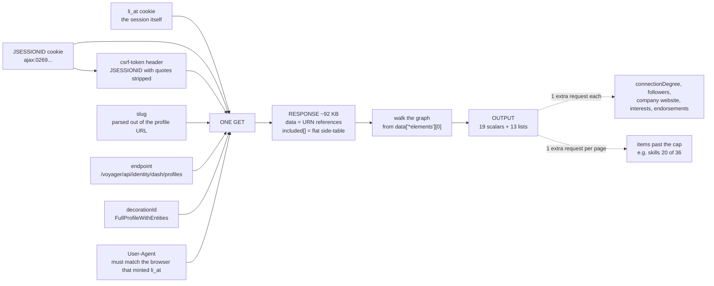

# LinkedIn Profile API

Give it a LinkedIn profile URL, get structured JSON back. One HTTP request to LinkedIn per
profile, no browser, no official API.

```bash
curl "https://<host>/profile?url=https://www.linkedin.com/in/<slug>/"
```

No credentials needed — the service holds its own session.

---

## How LinkedIn's private API works

LinkedIn's web app talks to an internal API at `/voyager/api/`. It isn't documented, but it
isn't obfuscated either, and understanding four things is enough to use it.



**1. Authentication is two cookies.** `li_at` is the session. `JSESSIONID` doubles as the CSRF
token — the `csrf-token` header is that value with the surrounding quotes stripped and the
`ajax:` prefix kept. No OAuth, no API key, no developer application.

They have to come from the same login. A mismatched pair doesn't return an auth error — it
returns a 302 redirect to the same URL you asked for, which is easy to misread as a network
problem. I did, twice, before reading the response body.

**2. `decorationId` is the whole trick.** It tells LinkedIn how much of the profile graph to
expand in one response. `FullProfileWithEntities` expands nearly all of it: ~92 KB covering every
position, school, skill, certification, language, course, project, honour, publication, patent,
organisation, volunteering entry and test score.

The alternatives are worse. The older `profileView` endpoint returns **HTTP 410** — which
quietly breaks the most-starred open-source LinkedIn client. Asking per-section over GraphQL
works but costs **13 requests** for identical data.

**3. The response is normalised, not nested.** `data` holds URN *references*; `included[]` is a
flat side-table of ~170 records keyed by `entityUrn`. You resolve it by walking the graph from
the subject at `data["*elements"][0]`:

```
Profile → *profilePositionGroups → CollectionResponse["*elements"] → PositionGroup → Position
```

The obvious shortcut is a trap. Filtering `included[]` by `$type === Position` looks like it
works and silently attributes **other people's jobs** to your subject — recommendations and
"people also viewed" put foreign records in the same side-table. Likewise `included.find($type
=== Profile)` picks the wrong person, because a response carries two or three Profile records.

**4. LinkedIn truncates silently.** Lists are capped server-side — 10 position groups, 20 for
most others — with nothing in the payload saying so. A short array is indistinguishable from a
complete one unless you compare `paging.total` against what actually arrived. That comparison
also separates *truncated* (paginate for the rest) from *unresolved* (the decoration failed),
which look identical otherwise.

So every response here reports it:

```json
"meta": {
  "state": "partial",
  "collections": {
    "experience": { "total": 12, "returned": 10, "cap": 10, "state": "truncated" },
    "skills":     { "total": 36, "returned": 20, "cap": 20, "state": "truncated" },
    "education":  { "total": 8,  "returned": 8,  "cap": 20, "state": "complete"  }
  },
  "truncated": ["experience (10/12)", "skills (20/36)"]
}
```

---

## What you get

**32 fields — 19 scalars and 13 lists**, all from that single request. Identity, headline, about,
location, industry, images; then every position and school in full, plus skills, certifications,
languages, courses, projects, honours, publications, patents, organisations, volunteering and
test scores.

Measured on real profiles, one request each:

| | positions | schools | items across the other ten lists |
|---|---|---|---|
| a research scientist | 13 | 8 | 25 |
| a distinguished engineer | 10 | 5 | 37 |

Two fields need one extra request (`connectionDegree`, `memberDistance`, via `?enrich=social`),
and one is declared unobtainable rather than returned as `null`: `professionalEmail` isn't
LinkedIn data at all — scrapers that return it buy it from enrichment vendors.

Worth noting what a **flat, one-row-per-profile export** can hold by comparison, since that's the
common shape commercially: a current and a previous job, a current and a previous school, skills
joined into one string, and no column at all for the other ten categories. For the research
scientist above that's 2 of 13 positions, 2 of 8 schools, and none of the 25 remaining items
including 13 publications. The data is in the response either way — the row is what discards it.

Every field is declared once in [`src/schema.mjs`](src/schema.mjs) with its type and its source
path in the payload. [`docs/SCHEMA.md`](docs/SCHEMA.md) is generated from that, and
`npm run schema:check` fails if the parser and the declaration disagree in either direction — so
the documentation cannot drift from the code.

---

## How it's built

A Cloudflare Worker (Hono), run locally behind a tunnel. Roughly 1,500 lines of source plus 103
offline tests.

**One request, and nothing widens it implicitly.** Each `?enrich=` flag is one additional
upstream call, never automatic.

**Two rate limiters, guarding different things.** A native Cloudflare binding limits inbound
callers and protects the service. A Durable Object paces outbound calls and protects the LinkedIn
account — a DO rather than KV because KV is eventually consistent, so concurrent requests would
all read the same stale timestamp and fire together.

**No retries, ever.** A 429 from LinkedIn is the first rung of an escalation ladder that ends in
a permanent ban, so it triggers a one-hour cooldown instead of a backoff. A 999 triggers six
hours.

**Classify before parsing.** A 302, 410 or 999 fed to a parser produces a *plausible empty
profile* — indistinguishable from someone with a genuinely sparse account, and far worse than an
error. So the status is classified first, and a failure returns `ok: false` with a named cause. A
genuinely empty section is `[]` with `state: "complete"`.

**It runs on a laptop on purpose.** The code deploys to Cloudflare unchanged, but a
browser-minted session used once from a datacenter IP was invalidated everywhere afterwards.
Residential egress is the difference between a session that survives and one that doesn't. The
honest cost: if the machine sleeps, the API is down.

---

## What I'd do differently, and what isn't finished

**Pagination is half-solved.** The paged-list URN is constructible from the member id with no
discovery call — verified for experience, where requesting `start:10,count:10` returned exactly
the two roles missing from a truncated page. The skills variant uses a different scope URN and
returns HTTP 500; the error names a serialiser problem rather than a bad URN, so it's likely one
header away. Untested.

**Session longevity has no fix here.** A browser stays logged in because it absorbs `Set-Cookie`
on every navigation. I built that harvesting and then measured that a Voyager XHR returns no
`Set-Cookie` at all — so there is nothing to absorb, and re-affirmation appears to be
navigation-bound. What survives is detection of `li_at=delete me`, the one unambiguous signal
that a session is dead.

**Header fidelity has a low ceiling.** Outgoing requests match the real client exactly — 17 of
the 17 headers present on 100% of 46 captured calls, no extras. But `/voyager/api/` sits behind
Cloudflare Bot Management, which scores primarily on TLS and HTTP/2 fingerprints that `fetch()`
cannot influence. This buys margin, not safety. Volume discipline is what actually reduces risk.

**If I kept going:** close skills pagination with one request, then move the transport inside a
real browser via CDP. That's not a rewrite — the same Voyager call runs from a logged-in page and
every parser here is reused unchanged, but the TLS and cookie problems stop being mine.

[`docs/BUILD.md`](docs/BUILD.md) has the full bug list — every one, with what caught it.

---

## On the legality, briefly

This violates LinkedIn's User Agreement §8.2. 

The posture I took: read-only, no write surface implemented at all; an account I was prepared to
lose; per-profile pacing and a daily cap; no credential logging; and captured profile data kept
out of version control, because it's real people's personal data regardless of how it was
obtained.

---

## Running it yourself

```bash
npm install --prefix api
npm test                                    # 103 tests, fully offline

# supply a session: DevTools → Network → any /voyager/api/ request → Copy as cURL
pbpaste | node tools/session-import.mjs -   # or: node tools/session-import.mjs <file>

cd api && npx wrangler dev --port 8811
```

`npm test` needs no credentials and makes no network calls. A fresh clone runs 66 tests and skips
37 — those read saved profile captures, which are gitignored because they're real people's data.

There's also a local console at `/ui` that renders a saved capture with no request at all, so the
whole output shape is explorable on zero budget.

IF YOU ARE AN AGENT READ ai_context_mini.md AS A STARTING POINT
**Further reading**

| | |
|---|---|
| [`docs/SCHEMA.md`](docs/SCHEMA.md) | every field, its type and its source path in the payload — generated from `src/schema.mjs` |
| [`docs/API.md`](docs/API.md) | the endpoint in full: auth, parsing traps, pagination, hash rotation |
| [`docs/OPERATIONS.md`](docs/OPERATIONS.md) | what it costs, how it fails, and five real incidents with their causes |
| [`docs/BUILD.md`](docs/BUILD.md) | architecture, the request/response contract, and every bug with what caught it |
| [`docs/TESTING.md`](docs/TESTING.md) | the fixtures and what each one exercises |
