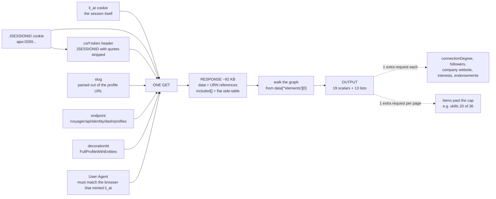

# LinkedIn Profile API

Give it a LinkedIn profile URL, get structured JSON back. One HTTP request to LinkedIn per
profile, no browser, no official API.

**Live:** `https://fluff.tail71ac66.ts.net`

```bash
curl "https://fluff.tail71ac66.ts.net/profile?url=https://www.linkedin.com/in/<slug>/"
```

No credentials needed — the service holds its own session. Health: [`/health`](https://fluff.tail71ac66.ts.net/health), console: [`/ui`](https://fluff.tail71ac66.ts.net/ui).

---

## How LinkedIn's private API works

LinkedIn's web app talks to an internal API at `/voyager/api/`. It isn't documented, but it
isn't obfuscated either, and understanding four things is enough to use it.



**1. Authentication is two cookies.** `li_at` is the session. `JSESSIONID` doubles as the CSRF
token — the `csrf-token` header is that value with the surrounding quotes stripped and the
`ajax:` prefix kept. No OAuth, no API key, no developer application.

They have to come from the same login. A mismatched pair doesn't return an auth error — it
returns a 302 redirect to the same URL you asked for, which is easy to misread as a network
problem. I did, twice, before reading the response body.

**2. `decorationId` is the whole trick.** It tells LinkedIn how much of the profile graph to
expand in one response. `FullProfileWithEntities` expands nearly all of it: ~92 KB covering every
position, school, skill, certification, language, course, project, honour, publication, patent,
organisation, volunteering entry and test score.

The alternatives are worse. The older `profileView` endpoint returns **HTTP 410** — which
quietly breaks the most-starred open-source LinkedIn client. Asking per-section over GraphQL
works but costs **13 requests** for identical data.

**3. The response is normalised, not nested.** `data` holds URN *references*; `included[]` is a
flat side-table of ~170 records keyed by `entityUrn`. You resolve it by walking the graph from
the subject at `data["*elements"][0]`:

```
Profile → *profilePositionGroups → CollectionResponse["*elements"] → PositionGroup → Position
```

The obvious shortcut is a trap. Filtering `included[]` by `$type === Position` looks like it
works and silently attributes **other people's jobs** to your subject — recommendations and
"people also viewed" put foreign records in the same side-table. Likewise `included.find($type
=== Profile)` picks the wrong person, because a response carries two or three Profile records.

**4. LinkedIn truncates silently.** Lists are capped server-side — 10 position groups, 20 for
most others — with nothing in the payload saying so. A short array is indistinguishable from a
complete one unless you compare `paging.total` against what actually arrived. That comparison
also separates *truncated* (paginate for the rest) from *unresolved* (the decoration failed),
which look identical otherwise.

So every response here reports it:

```json
"meta": {
  "state": "partial",
  "collections": {
    "experience": { "total": 12, "returned": 10, "cap": 10, "state": "truncated" },
    "skills":     { "total": 36, "returned": 20, "cap": 20, "state": "truncated" },
    "education":  { "total": 8,  "returned": 8,  "cap": 20, "state": "complete"  }
  },
  "truncated": ["experience (10/12)", "skills (20/36)"]
}
```

---

## What you get

**32 fields — 19 scalars and 13 lists**, all from that single request. Identity, headline, about,
location, industry, images; then every position and school in full, plus skills, certifications,
languages, courses, projects, honours, publications, patents, organisations, volunteering and
test scores.

Measured on real profiles, one request each:

| | positions | schools | items across the other ten lists |
|---|---|---|---|
| a research scientist | 13 | 8 | 25 |
| a distinguished engineer | 10 | 5 | 37 |

Two fields need one extra request (`connectionDegree`, `memberDistance`, via `?enrich=social`),
and one is declared unobtainable rather than returned as `null`: `professionalEmail` isn't
LinkedIn data at all — scrapers that return it buy it from enrichment vendors.

Worth noting what a **flat, one-row-per-profile export** can hold by comparison, since that's the
common shape commercially: a current and a previous job, a current and a previous school, skills
joined into one string, and no column at all for the other ten categories. For the research
scientist above that's 2 of 13 positions, 2 of 8 schools, and none of the 25 remaining items
including 13 publications. The data is in the response either way — the row is what discards it.

Every field is declared once in [`src/schema.mjs`](src/schema.mjs) with its type and its source
path in the payload. [`docs/SCHEMA.md`](docs/SCHEMA.md) is generated from that, and
`npm run schema:check` fails if the parser and the declaration disagree in either direction — so
the documentation cannot drift from the code.

---

## API documentation

| endpoint | upstream calls | returns |
|---|---|---|
| `GET /profile?url=…` | **1** | the profile |
| `GET /profile?url=…&enrich=…` | 1 + one per name | adds opt-in sections |
| `GET /schema` | 0 | every declared field, its type and source path |
| `GET /budget` | 0 | requests spent today, the cap, any cooldown |
| `GET /health` | 0 | liveness and egress mode |
| `GET /ui` | 0 | a browsable console |

**Parameters**

| | |
|---|---|
| `url` *or* `slug` | a profile URL, a bare slug, or an `ACoAA…` member id. A full URN returns 400 |
| `enrich` | comma-separated: `social`, `counts`, `company`, `interests`, `endorsements`. Each costs one extra upstream request and is never applied implicitly |

No request headers are required — the server uses its own bound session. Sending `x-li-at` and
`x-li-jsessionid` overrides it and spends your account instead.

### Response

```jsonc
{ "ok": true,
  "profile": {
    "name": "…", "headline": "…", "location": "…", "industry": "…",
    "experience": [ { "title": "Principal Scientist",
                      "company": "PTC Therapeutics, Inc.",
                      "companySlug": "ptc-therapeutics",
                      "companyIndustry": "Biotechnology",
                      "employmentType": "Full-time",
                      "dates": { "start": "9/2023", "end": "5/2024",
                                 "current": false, "text": "Sep 2023 - May 2024" },
                      "location": "New Jersey, United States" } ],
    "education": [ … ], "publications": [ … ], "skills": [ … ]
  },
  "meta": {
    "state": "partial",
    "includedCount": 170,
    "upstreamRequests": 1,
    "credentialSource": "binding",
    "collections": {
      "experience": { "total": 12, "returned": 10, "cap": 10, "state": "truncated" },
      "skills":     { "total": 36, "returned": 20, "cap": 20, "state": "truncated" },
      "education":  { "total": 8,  "returned": 8,  "cap": 20, "state": "complete"  }
    },
    "truncated": ["experience (10/12)", "skills (20/36)"],
    "unresolved": []
  } }
```

`meta.collections` is the part that makes the output trustworthy. `state` is `complete` when
`total === returned`; `truncated` when more exist and the cap was hit, so paginating would get
them; and `unresolved` when fewer than the cap arrived but `total` says more exist — meaning the
decoration failed rather than the person having little. Those two look identical in the payload
and mean opposite things.

### Errors

There is never an empty success. A 302, 410 or 999 handed to a parser produces a plausible empty
profile, so failures return `ok: false` with a named cause and a hint. **Nothing here is
retryable** — where LinkedIn is signalling load, retrying is what escalates it.

| error | HTTP | means |
|---|---|---|
| `bad_request` | 400 | the url or slug did not parse |
| `no_user_agent` | 400 | no UA configured, and there is deliberately no default |
| `no_credentials` | 401 | the server has no session bound |
| `SESSION_INVALID` | 401 | 3xx to the login wall, or a self-redirect — cookies stale, or the pair is mismatched |
| `SESSION_KILLED` | 401 | `set-cookie: li_at=delete me` — the session is dead, re-login |
| `CSRF_REJECTED` | 401 | 403 upstream: the csrf header, or a restricted profile |
| `FORBIDDEN` | 403 | this profile may be restricted; five in a row means a session problem |
| `NOT_FOUND` | 404 | no such public identifier |
| `rate_limit_exceeded` | 429 | **our** inbound limiter, not LinkedIn's |
| `RATE_LIMITED` | 429 | LinkedIn throttled us; a cooldown is now in force |
| `REQUEST_DENIED` | 429 | HTTP 999, a network-layer block — stop for hours |
| `upstream_budget` | 429 | daily cap reached, or a cooldown is active |
| `upstream_disabled` | 503 | the kill switch is armed |
| `SCHEMA_DRIFT` | 502 | the decoration id likely rotated — re-capture it |
| `GONE` | 502 | the endpoint was retired |
| `PARSE_FAILED` · `transport_error` | 502 | the response shape changed, or the fetch threw |

Enrichments never fail the call. If one is skipped — a cooldown, a missing company slug — it is
recorded in `meta.enrichmentSkipped` with the reason and the profile still returns.

---

## How it's built

A Cloudflare Worker (Hono), run locally behind a tunnel. Roughly 1,500 lines of source plus 103
offline tests.

**One request, and nothing widens it implicitly.** Each `?enrich=` flag is one additional
upstream call, never automatic.

**Two rate limiters, guarding different things.** A native Cloudflare binding limits inbound
callers and protects the service. A Durable Object paces outbound calls and protects the LinkedIn
account — a DO rather than KV because KV is eventually consistent, so concurrent requests would
all read the same stale timestamp and fire together.

**No retries, ever.** A 429 from LinkedIn is the first rung of an escalation ladder that ends in
a permanent ban, so it triggers a one-hour cooldown instead of a backoff. A 999 triggers six
hours.

**Classify before parsing.** A 302, 410 or 999 fed to a parser produces a *plausible empty
profile* — indistinguishable from someone with a genuinely sparse account, and far worse than an
error. So the status is classified first, and a failure returns `ok: false` with a named cause. A
genuinely empty section is `[]` with `state: "complete"`.

**It runs on a laptop on purpose.** The code deploys to Cloudflare unchanged, but a
browser-minted session used once from a datacenter IP was invalidated everywhere afterwards.
Residential egress is the difference between a session that survives and one that doesn't. The
honest cost: if the machine sleeps, the API is down.

---

## Maintainability: what rotates, and how to fix it

This is a private API, so parts of it move. Three things drift, and none of them announce
themselves.

**`queryId` hashes.** The web client mints these at runtime against its own webpack bundle, so
they are pinned to whatever build LinkedIn currently has deployed. Two live in this codebase —
one for profile components, one for company lookup — in `api/src/transport.js`.

**`decorationId` suffixes.** The `-101` in `FullProfileWithEntities-101` is a version. `-109`
also works today. It lives in `api/src/transport.js` and can be overridden with
`LINKEDIN_PROFILE_DECORATION`.

**`x-li-track`'s `clientVersion`.** Pinned to a deployed build too, and refreshed whenever you
re-import a session.

### Why a mismatch is hard to notice

A rotated hash usually does not error. It returns **HTTP 200 with a null section and no error
message** — byte-identical to a section that is genuinely empty, and to a section name that never
existed. A null proves nothing on its own, so detection cannot rely on exceptions:

- **Pinned counts.** The offline suite asserts exact per-collection numbers against saved
  captures, so drift shows up as a changed number rather than a thrown error.
- **`paging.total`** separates *truncated* from *unresolved* — a decoration that silently failed
  returns fewer items than the cap, which looks nothing like a page boundary once you compare.
- **A control request** with a deliberately invented section name, to confirm that a null is a
  real null.

One thing that misleads: **a hash is per query *shape*, not per resource.** One captured session
used three different `voyagerOrganizationDashCompanies` hashes concurrently, for three different
field selections. So a hash that disagrees with some reference is not evidence of staleness — it
may simply be a different query.

### Re-deriving a hash, cheapest first

**1. Read them out of the web bundle.** LinkedIn's own JavaScript registers every persisted query
as `{kind:"query", id:"<resource>.<32hex>", name:"<slug>"}` — a self-documenting catalogue of
**933 queries with human-readable names**, served from `static.licdn.com` with no cookies and no
API call:

```bash
node tools/queryids.mjs <bundle.js> company     # filter by name
node tools/queryids.mjs <bundle.js> --json      # the whole registry
```

This is how the company query was identified after four wrong guesses taken from other projects.
It beats the alternatives because it carries LinkedIn's *own* name for each hash — a captured
request can be correct and still be mislabelled by whoever wrote it down.

**2. Decompile the Android APK** — 481 hashes, statically, no session needed. One catch: Android
hashes are different field selections and want `accept: application/json`. Used with the web
`accept` they return HTTP 500 from the serialiser, which reads like a rejection and is not one.

**3. Capture live traffic** and read the `queryId` off the URL. Works, but one endpoint at a time
and it costs requests.

### Treat them as config, not literals

Hashes and decorations belong in configuration with a note on where they came from and when — not
inlined in request logic. A 400 naming an unknown decoration is a *drift signal*, not a bug. The
cautionary tale is `profileView`: it returned HTTP 410 one day and silently broke the
ecosystem's most popular open-source LinkedIn client, whose profile path still targets it.

`docs/OPERATIONS.md` has the full runbook; `docs/API.md` §8–9 covers the `accept` coupling and
the rotation detail.

---

## What I'd do differently, and what isn't finished

**Pagination is half-solved.** The paged-list URN is constructible from the member id with no
discovery call — verified for experience, where requesting `start:10,count:10` returned exactly
the two roles missing from a truncated page. The skills variant uses a different scope URN and
returns HTTP 500; the error names a serialiser problem rather than a bad URN, so it's likely one
header away. Untested.

**Session refresh is not implemented.** LinkedIn rotates `li_at` on page loads, never on Voyager
XHRs (58 captured API responses, zero `Set-Cookie`). The harvester in `src/session.mjs` works;
it just needs a periodic page GET on the same jar to feed it. Not done. `li_at=delete me`
detection is.

**Header fidelity has a low ceiling.** Outgoing requests match the real client exactly — 17 of
the 17 headers present on 100% of 46 captured calls, no extras. But `/voyager/api/` sits behind
Cloudflare Bot Management, which scores primarily on TLS and HTTP/2 fingerprints that `fetch()`
cannot influence. This buys margin, not safety. Volume discipline is what actually reduces risk.

**If I kept going:** close skills pagination with one request, then move the transport inside a
real browser via CDP. That's not a rewrite — the same Voyager call runs from a logged-in page and
every parser here is reused unchanged, but the TLS and cookie problems stop being mine.

[`docs/BUILD.md`](docs/BUILD.md) has the full bug list — every one, with what caught it.

---

## On the legality, briefly

This violates LinkedIn's User Agreement §8.2. 

The posture I took: read-only, no write surface implemented at all; an account I was prepared to
lose; per-profile pacing and a daily cap; no credential logging; and captured profile data kept
out of version control, because it's real people's personal data regardless of how it was
obtained.

---

## Running it yourself

```bash
npm install --prefix api
npm test                                    # 103 tests, fully offline

# supply a session: DevTools → Network → any /voyager/api/ request → Copy as cURL
pbpaste | node tools/session-import.mjs -   # or: node tools/session-import.mjs <file>

cd api && npx wrangler dev --port 8811
```

`npm test` needs no credentials and makes no network calls. A fresh clone runs 66 tests and skips
37 — those read saved profile captures, which are gitignored because they're real people's data.

There's also a local console at `/ui` that renders a saved capture with no request at all, so the
whole output shape is explorable on zero budget.

IF YOU ARE AN AGENT READ ai_context_mini.md AS A STARTING POINT
**Further reading**

| | |
|---|---|
| [`docs/SCHEMA.md`](docs/SCHEMA.md) | every field, its type and its source path in the payload — generated from `src/schema.mjs` |
| [`docs/API.md`](docs/API.md) | the endpoint in full: auth, parsing traps, pagination, hash rotation |
| [`docs/OPERATIONS.md`](docs/OPERATIONS.md) | what it costs, how it fails, and five real incidents with their causes |
| [`docs/BUILD.md`](docs/BUILD.md) | architecture, the request/response contract, and every bug with what caught it |
| [`docs/TESTING.md`](docs/TESTING.md) | the fixtures and what each one exercises |

---

## Repo map

```
api/src/       the Worker — routes, classify, transport, the Durable Object limiter
src/           parsers and transport, shared with the CLI and the tests
  schema.mjs     the single field declaration — add a field here and nowhere else
  profile-graph.mjs   the graph walk
  session.mjs    header construction, cookie pruning, the kill switch
tools/         schema (check + generate docs), session-import, field-explorer, queryids
tests/         103 offline tests
docs/          the detail this README points at
captures/      saved responses — gitignored, real people's data
```

| doc | what is in it |
|---|---|
| [docs/SCHEMA.md](docs/SCHEMA.md) | every field, its type and its source path — generated from `src/schema.mjs` |
| [docs/API.md](docs/API.md) | the endpoint in full: auth, parsing traps, pagination, hash rotation |
| [docs/OPERATIONS.md](docs/OPERATIONS.md) | what it costs, how it fails, and five real incidents with causes |
| [docs/BUILD.md](docs/BUILD.md) | architecture, the request/response contract, every bug and what caught it |
| [docs/TESTING.md](docs/TESTING.md) | the fixtures and what each one exercises |
